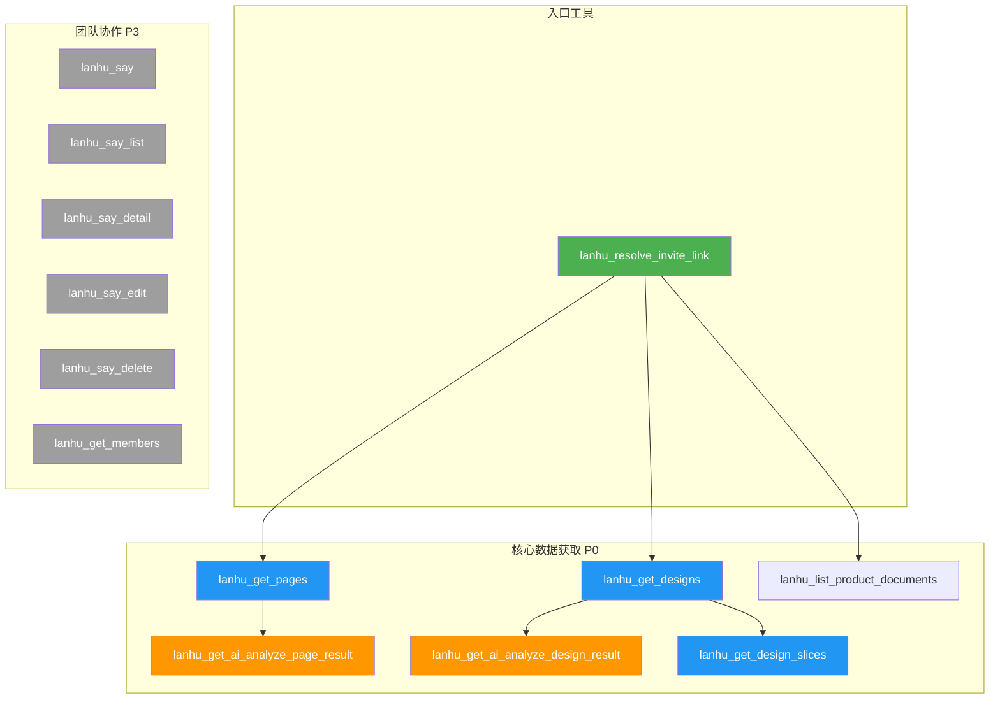
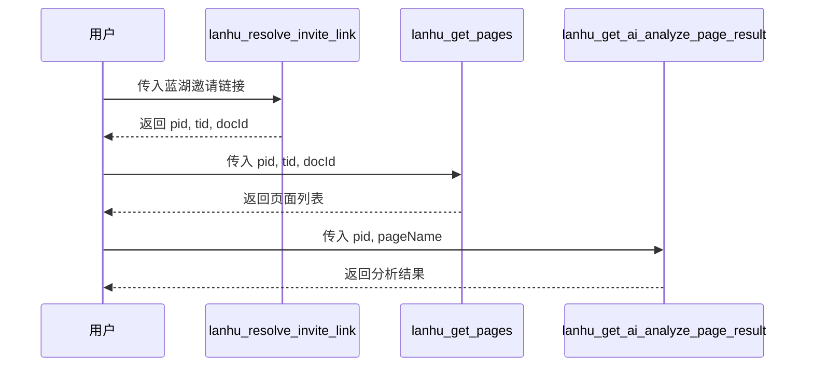
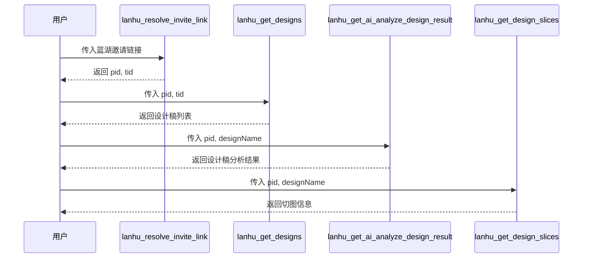
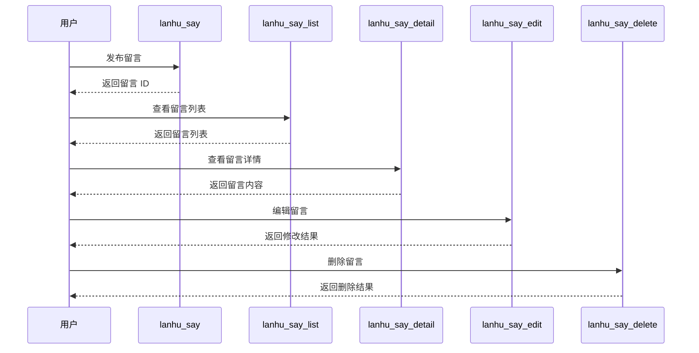
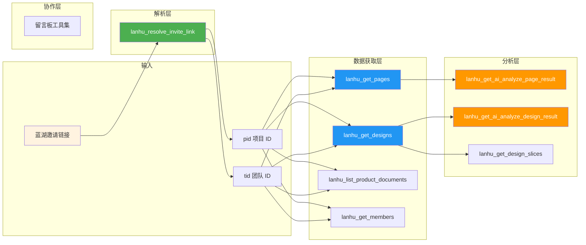

# 蓝湖 MCP 工具关系图

本文档描述 dz-lanhu-mcp 项目中所有 MCP 工具之间的依赖关系和调用链。

---

## 📊 工具依赖关系总览



---

## 📋 工具详细说明

### 入口工具

| 工具 | 功能 | 返回参数 | 依赖 |
|------|------|---------|------|
| `lanhu_resolve_invite_link` | 解析蓝湖邀请链接 | `tid`, `pid`, `docId` | 无 |

### 核心数据获取工具 (P0)

| 工具 | 依赖参数 | 被依赖工具 |
|------|---------|-----------|
| `lanhu_get_pages` | `pid`, `tid`, `docId` | `lanhu_get_ai_analyze_page_result` |
| `lanhu_get_designs` | `pid`, `tid` | `lanhu_get_ai_analyze_design_result`, `lanhu_get_design_slices` |
| `lanhu_get_ai_analyze_page_result` | `pid`, `pageName` | 无 |
| `lanhu_get_ai_analyze_design_result` | `pid`, `designName` | 无 |
| `lanhu_get_design_slices` | `pid`, `designName` | 无 |
| `lanhu_list_product_documents` | `pid`, `tid` | 无 |

### 团队协作工具 (P3)

| 工具 | 依赖参数 | 备注 |
|------|---------|------|
| `lanhu_say` | `pid`, `tid` | 发布留言 |
| `lanhu_say_list` | `pid`, `tid` | 查看留言列表 |
| `lanhu_say_detail` | `pid`, `tid`, `messageId` | 查看留言详情 |
| `lanhu_say_edit` | `pid`, `tid`, `messageId` | 编辑留言 |
| `lanhu_say_delete` | `pid`, `tid`, `messageId` | 删除留言 |
| `lanhu_get_members` | `pid`, `tid` | 查看协作者 |

---

## 🔗 调用链关系

### 调用链 1: 需求文档分析全流程



**说明**:
1. 用户首先调用 `lanhu_resolve_invite_link` 解析邀请链接
2. 从返回结果中获取 `pid`（项目 ID）、`tid`（团队 ID）、`docId`（文档 ID）
3. 调用 `lanhu_get_pages` 获取项目下所有原型页面
4. 从页面列表中选择一个页面，调用 `lanhu_get_ai_analyze_page_result` 分析

### 调用链 2: UI 设计稿分析全流程



**说明**:
1. 用户首先调用 `lanhu_resolve_invite_link` 解析邀请链接
2. 从返回结果中获取 `pid`（项目 ID）、`tid`（团队 ID）
3. 调用 `lanhu_get_designs` 获取项目下所有 UI 设计稿
4. 可选择调用 `lanhu_get_ai_analyze_design_result` 分析设计稿
5. 可选择调用 `lanhu_get_design_slices` 获取切图资源

### 调用链 3: 团队协作留言



### 调用链 4: 直接传参模式

所有工具支持两种调用方式：

**方式 A: 通过邀请链接解析（推荐）**
```
用户 → lanhu_resolve_invite_link → pid/tid/docId → 其他工具
```

**方式 B: 直接传入参数**
```
用户 → 其他工具（直接传入 pid, tid）
```

---

## 📐 数据流转图



---

## 🏗️ 代码模块结构

```
packages/dz-lanhu-mcp/src/
├── tools/
│   ├── resolve-link.ts        ← 入口工具
│   ├── get-pages.ts           ← 核心数据
│   ├── get-designs.ts         ← 核心数据
│   ├── get-slices.ts          ← 核心数据
│   ├── analyze-page.ts        ← AI 分析
│   ├── analyze-design.ts      ← AI 分析
│   ├── say.ts                 ← 团队协作
│   ├── say-list.ts            ← 团队协作
│   ├── say-detail.ts          ← 团队协作
│   ├── say-edit.ts            ← 团队协作
│   ├── say-delete.ts          ← 团队协作
│   ├── get-members.ts         ← 团队协作
│   └── index.ts               ← 统一导出
├── api/
│   ├── client.ts              ← HTTP 客户端
│   ├── designs.ts             ← 设计稿 API
│   ├── members.ts             ← 成员 API
│   └── products.ts            ← 产品 API
├── utils/
│   ├── url-parser.ts          ← URL 解析工具
│   └── role-matcher.ts        ← 角色匹配工具
└── index.ts                   ← 服务器入口
```

---

## 📌 参数传递约定

所有工具使用统一的参数命名规范：

| 参数 | 来源 | 说明 |
|------|------|------|
| `tid` | 邀请链接解析 | 团队 ID，从蓝湖邀请链接中提取 |
| `pid` | 邀请链接解析 / 直接传入 | 项目 ID |
| `docId` | 邀请链接解析 | 文档 ID（用于原型文档） |
| `pageName` / `pageId` | `lanhu_get_pages` 返回 | 页面标识 |
| `designName` / `designId` | `lanhu_get_designs` 返回 | 设计稿标识 |
| `messageId` | 留言 API 返回 | 留言 ID |